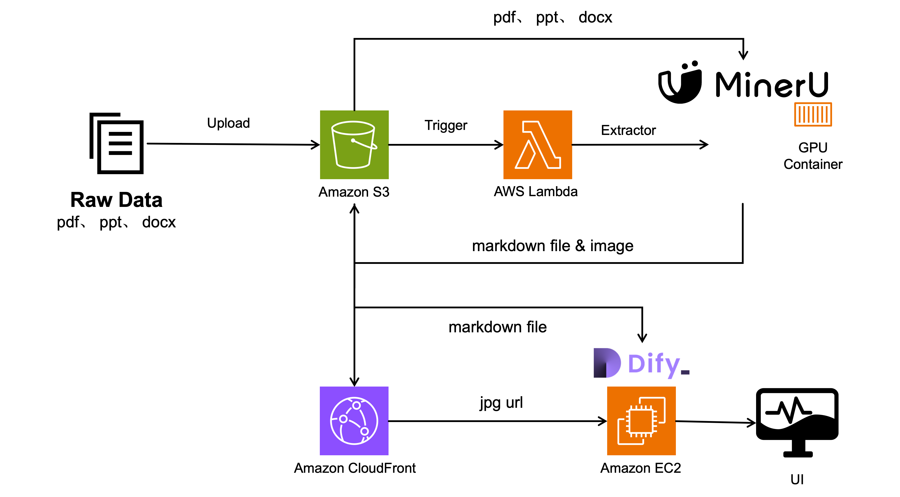

# Sample: MinerU on AWS ECS with GPU Acceleration

[](LICENSE)
[](https://aws.amazon.com/ecs/)
[](https://www.nvidia.com/en-us/data-center/tesla-t4/)
[](https://www.python.org/)
[](https://github.com/opendatalab/MinerU)

This sample demonstrates how to deploy [MinerU v3](https://github.com/opendatalab/MinerU) PDF processing engine on AWS ECS with GPU acceleration using a serverless architecture. It uses MinerU's `hybrid-auto-engine` backend with vLLM for high-accuracy document parsing via a 1.2B VLM model.

> **⚠️ Important**: This is sample code for demonstration and learning purposes. Before using in production, please review and adjust the code according to your organization's security, compliance, and operational requirements.

---

## 📋 Table of Contents

- [Overview](#-overview)
- [Architecture](#-architecture)
- [Prerequisites](#-prerequisites)
- [Quick Start](#-quick-start)
- [Docker Image](#-docker-image)
- [Configuration](#-configuration)
- [Usage](#-usage)
- [Monitoring](#-monitoring)
- [Cost Optimization](#-cost-optimization)
- [Troubleshooting](#-troubleshooting)
- [Related Resources](#-related-resources)

---

## 🚀 Overview

A cloud-native PDF document processing platform for enterprise RAG applications. Combines MinerU v3's hybrid-auto-engine with AWS serverless architecture for high accuracy, GPU-accelerated document parsing.

### Key Capabilities

- **MinerU v3 hybrid-auto-engine**: 90+ accuracy on OmniDocBench (v1.5), combining pipeline OCR with 1.2B VLM model
- **GPU Accelerated**: NVIDIA T4 (g4dn.xlarge), 44-page PDF processed in ~3 minutes
- **Serverless & Event-Driven**: S3 upload triggers automatic processing via SQS → ECS
- **Auto-Scaling**: 0-10 instances based on queue depth, zero cost when idle
- **Python API Integration**: Direct `do_parse()` call, no subprocess/HTTP overhead
- **AL2023 ECS AMI**: Dynamic SSM parameter resolution, always up-to-date

### Supported Document Types

- PDF (text, scanned, mixed), images (PNG/JPG), DOCX
- 109 languages via OCR
- LaTeX formula extraction, HTML table conversion, image extraction
- Markdown + JSON output formats

---

## 🏗️ Architecture



```
S3 Upload (input/) → Lambda Trigger → SQS Queue → ECS Task (GPU)
                                                      ↓
                                              MinerU v3 do_parse()
                                              (hybrid-auto-engine)
                                                      ↓
                                              S3 Output (processed/)
                                                      ↓
                                              Lambda Post-Process
                                              (CloudFront URL rewrite)
```

### Components

| Layer | Service | Purpose |
|-------|---------|---------|
| Input | S3 + Lambda | PDF upload triggers processing |
| Queue | SQS + DLQ | Job queuing with retry |
| Compute | ECS + g4dn.xlarge | GPU container with MinerU v3 |
| Storage | S3 + DynamoDB | Output files + job tracking |
| CDN | CloudFront + Lambda | Image serving with URL rewrite |
| Infra | VPC + NAT + Endpoints | Network with private subnets |

### CloudFormation Stacks

| Stack | Template | Resources |
|-------|----------|-----------|
| Infrastructure | `01-ecs-infrastructure.yaml` | VPC, ECS Cluster, ASG, Launch Template (AL2023) |
| Data Services | `02-ecs-data-services.yaml` | S3, DynamoDB, SQS, CloudFront |
| Trigger Services | `03-ecs-trigger-services.yaml` | Lambda triggers, S3 notifications |
| Compute Services | `04-ecs-compute-services.yaml` | ECS Task Definition, Service, Auto Scaling |

---

## 📋 Prerequisites

- AWS Account with GPU instance quota (Service Quotas → EC2 → Running On-Demand G and VT instances)
- AWS CLI configured
- Docker (for building custom images)
- Sufficient EIP quota (2 required for NAT Gateways)

### Instance Requirements (MinerU v3 hybrid-auto-engine)

| Resource | Minimum | Configured |
|----------|---------|------------|
| GPU VRAM | 8 GB | T4 16 GB |
| System RAM | 16 GB | g4dn.xlarge 16 GB |
| Disk | 20 GB SSD | 200 GB gp3 |
| GPU Architecture | Volta (7.0+) | Turing (7.5) |

---

## 🚀 Quick Start

### 1. Clone and Deploy

```bash
git clone https://github.com/aws-samples/sample-mineru-ecs-gpu-deployment.git
cd sample-mineru-ecs-gpu-deployment

# Validate configuration
./deploy-cross-account.sh validate

# Deploy all 4 stacks
./deploy-cross-account.sh deploy-all
```

### 2. Test

```bash
# Upload a PDF
aws s3 cp test.pdf s3://mineru-ecs-production-data-<ACCOUNT_ID>/input/

# Check job status in DynamoDB
aws dynamodb scan --table-name mineru-ecs-production-processing-jobs \
  --filter-expression "#s = :status" \
  --expression-attribute-names '{"#s":"status"}' \
  --expression-attribute-values '{":status":{"S":"completed"}}'

# Download results
aws s3 ls s3://mineru-ecs-production-data-<ACCOUNT_ID>/processed/ --recursive
```

### 3. Clean Up

```bash
./deploy-cross-account.sh delete-all
```

---

## 🐳 Docker Image

### Pre-built Image

```
public.ecr.aws/b1
v8r5t6/mineru-ecs-gpu:latest
```

Based on `vllm/vllm-openai:v0.11.2` with:
- MinerU v3 (`mineru[core]>=3.0.0`)
- vLLM for hybrid-auto-engine inference
- Pre-downloaded pipeline + VLM models (~10 GB)
- Image size: ~35 GB (compressed ~18 GB)

### Build Custom Image

```bash
cd docker

# Build locally
docker build -f Dockerfile.ecs-gpu -t mineru-ecs-gpu:latest .

# Push to your ECR
./build.sh -r <ACCOUNT_ID>.dkr.ecr.<REGION>.amazonaws.com -n mineru-ecs-gpu -t latest -p
```

> **Note**: Build requires ~200 GB disk space. Recommended to build on an EC2 instance (e.g., c5.2xlarge with 200 GB gp3).

### Key Environment Variables

| Variable | Default | Description |
|----------|---------|-------------|
| `MINERU_BACKEND` | `hybrid-auto-engine` | MinerU parsing backend |
| `MINERU_DEVICE_MODE` | `cuda` | Device mode (cuda/cpu) |
| `MINERU_MODEL_SOURCE` | `local` | Use pre-downloaded models |
| `MINERU_LANGUAGE` | `ch` | OCR language hint |
| `SQS_QUEUE_URL` | (required) | SQS queue for job messages |
| `DYNAMODB_TABLE` | (required) | DynamoDB table for job tracking |
| `BUCKET_NAME` | (required) | S3 bucket for input/output |

---

## ⚙️ Configuration

### config.yaml

```yaml
default:
  project_name: mineru-ecs
  environment: production
  aws_region: us-east-1
  instance_type: g4dn.xlarge    # GPU instance
  volume_size: 200              # Disk for 35GB image
  task_cpu: 3072                # 3 vCPU
  task_memory: 12288            # 12 GB
  container_image: public.ecr.aws/b1v8r5t6/mineru-ecs-gpu:latest
  startup_mode: prewarmed       # Keep container running
  use_gpu: true
```

### Supported Instance Types

| Instance | GPU | VRAM | RAM | Use Case |
|----------|-----|------|-----|----------|
| g4dn.xlarge | 1x T4 | 16 GB | 16 GB | Default, cost-effective |
| g4dn.2xlarge | 1x T4 | 16 GB | 32 GB | More RAM for large docs |
| g4dn.4xlarge | 1x T4 | 16 GB | 64 GB | Heavy concurrent processing |

### Backend Options

| Backend | Flag | GPU Required | Accuracy | Use Case |
|---------|------|-------------|----------|----------|
| `hybrid-auto-engine` | `-b hybrid-auto-engine` | Yes (8GB+) | 90+ | Default, highest accuracy |
| `pipeline` | `-b pipeline` | No (CPU ok) | 86+ | CPU-only environments |

To switch to CPU mode, change `MINERU_BACKEND` to `pipeline` in the ECS task definition and use a non-GPU instance type.

---

## 📖 Usage

### Upload PDF for Processing

```bash
aws s3 cp document.pdf s3://mineru-ecs-production-data-<ACCOUNT_ID>/input/
```

Processing is automatic: S3 event → Lambda → SQS → ECS container picks up the job.

### Check Job Status

```bash
aws dynamodb get-item \
  --table-name mineru-ecs-production-processing-jobs \
  --key '{"job_id": {"S": "<JOB_ID>"}}'
```

### Download Results

```bash
aws s3 cp s3://mineru-ecs-production-data-<ACCOUNT_ID>/processed/<JOB_ID>/ ./output/ --recursive
```

Output structure:
```
processed/<JOB_ID>/
  <filename>/
    hybrid_auto/
      <filename>.md          # Markdown output
      <filename>_layout.pdf  # Layout visualization
      images/                # Extracted images
```

### Deploy to Different Environments

```bash
# Development (on-demand, scales to 0)
./deploy-cross-account.sh -e development deploy-all

# Staging
./deploy-cross-account.sh -e staging deploy-all

# Production (default)
./deploy-cross-account.sh deploy-all
```

---

## 📊 Monitoring

### CloudWatch Logs

```bash
# ECS container logs
aws logs tail /ecs/mineru-ecs-production --follow --region us-west-2

# Lambda trigger logs
aws logs tail /aws/lambda/mineru-ecs-production-s3-trigger --follow
```

### Key Metrics

- **SQS Queue Depth**: Triggers auto-scaling (scale up > 5 messages, scale down < 2)
- **ECS Task Count**: Running GPU containers
- **Health Check**: `GET /health` on port 8080 (30s interval)

### Check Service Status

```bash
./deploy-cross-account.sh status
```

---

## 💰 Cost Optimization

### Estimated Monthly Costs

| Usage | ECS (g4dn.xlarge) | S3 + DynamoDB | CloudFront | Total |
|-------|-------------------|---------------|------------|-------|
| Low (10 docs/day) | ~$0 (scales to 0) | ~$2 | ~$1 | ~$3 |
| Medium (100 docs/day) | ~$50 | ~$10 | ~$10 | ~$70 |
| High (1000 docs/day) | ~$500 | ~$100 | ~$100 | ~$700 |

### Tips

- Use `startup_mode: on-demand` for infrequent usage (container starts only when jobs arrive)
- Set `min_size: 0` to allow full scale-in
- Consider Spot Instances for non-critical workloads
- Use S3 Lifecycle policies to archive old processed files

---

## 🔧 Troubleshooting

### ECS Task Fails to Start

- Check GPU instance quota: Service Quotas → EC2 → G and VT instances
- Verify disk space: 200 GB needed for 35 GB image
- Check VPC endpoints: ECR, CloudFormation, Logs endpoints required

### First Job Takes Long (~3 min)

Normal behavior. vLLM compiles CUDA kernels on first run (T4 compute capability 7.5). Subsequent jobs are much faster.

### "No module named X" Errors

The Docker image may be missing a dependency. Rebuild with the missing package added to the Dockerfile.

### Processing Fails with OOM

- Increase `task_memory` in config.yaml
- Use a larger instance type (g4dn.2xlarge for 32 GB RAM)
- Reduce concurrent processing

### Debug Commands

```bash
# Check ECS task status
aws ecs describe-tasks --cluster mineru-ecs-production-cluster \
  --tasks $(aws ecs list-tasks --cluster mineru-ecs-production-cluster --query 'taskArns[0]' --output text)

# View container logs
aws logs filter-log-events --log-group-name /ecs/mineru-ecs-production \
  --filter-pattern "ERROR"

# Check SQS queue depth
aws sqs get-queue-attributes \
  --queue-url https://sqs.<REGION>.amazonaws.com/<ACCOUNT_ID>/mineru-ecs-production-processing-queue \
  --attribute-names ApproximateNumberOfMessages
```

---

## 📚 Related Resources

- [MinerU GitHub](https://github.com/opendatalab/MinerU) — MinerU v3 source code and documentation
- [MinerU README (中文)](https://github.com/opendatalab/MinerU/blob/master/README_zh-CN.md) — Chinese documentation
- [Amazon ECS GPU Workloads](https://docs.aws.amazon.com/AmazonECS/latest/developerguide/ecs-gpu.html)
- [ECS-optimized AL2023 AMI](https://docs.aws.amazon.com/AmazonECS/latest/developerguide/ecs-optimized_AMI.html)
- [vLLM Documentation](https://docs.vllm.ai/)

---

## 🤝 Contributing

See [CONTRIBUTING.md](CONTRIBUTING.md) for details on how to contribute to this sample.

## 📄 License

This sample code is licensed under the MIT-0 License. See the [LICENSE](LICENSE) file.

## 🔒 Security

See [SECURITY.md](SECURITY.md) for security best practices and reporting vulnerabilities.

---

**Note**: This is sample code for demonstration purposes. Please review and test thoroughly before using in production environments.
